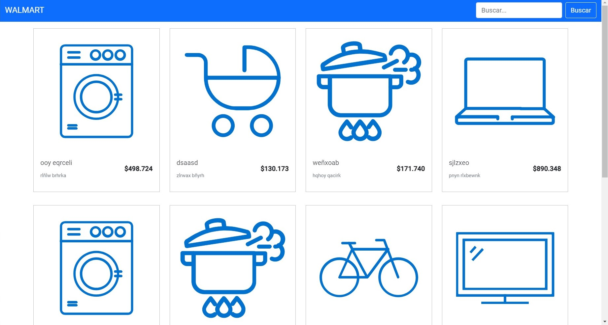
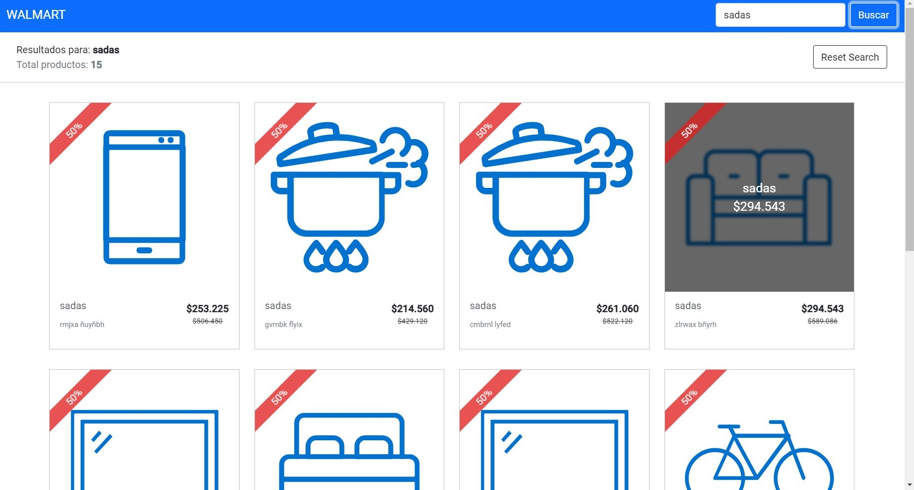

# Desafío Walmart Fullstack Palíndromo

## Welcome!

This is my proposed solution for `Desafío Walmart Fullstack Palíndromo`!

The technologies used were:

- NodeJS
- Angular
- MongoDB
- Docker

## Prerequisites

To use these files, you must first have the following installed:

- [git](https://git-scm.com/)
- [docker](https://docs.docker.com/engine/installation/)
- [docker-compose](https://docs.docker.com/compose/install/)

## How to use

The following steps will run a local instance of the solution using the configuration file (`docker-compose.yml`):

1. Clone this repository.

```bash
git clone https://github.com/chelosky/Desafio-Walmart-Fullstack-Palindromo.git
```

2. Change directory into the root of the project.

```bash
cd  Desafio-Walmart-Fullstack-Palindromo
```

3. Build and Run the project with one of the follows commands:

- With docker-compose commands:

```bash
docker-compose up
# if you need the project execute in the background, use the -d, --detach option
docker-compose up -d
```
- With `make` commands: (`Makefile`)
``` bash
make project-execute
# if you need the project execute in the background, use this command instead
make project-execute-background
```

After executing these commands, the solution servers will have started running. This process takes approximately 3-10 minutes to complete. (Angular takes too long to serve)

The above commands create the project containers and run them. The executed containers are the follows: 
- **database**: mongodb 
- **database_seed**: import the products to mongodb
- **backend**: Nodejs
- **backend_test**: Test the backend to generate coverage report
- **frontend**: Angular

## Playground - Backend

To access to the backend, you have to open [http://localhost:5000](http://localhost:5000) in your browser.

API Resources:
 - [GET /product](#get-products)
 - [GET /product/[id]](#get-product-by-id)

### Get Products

Request:

`GET http://localhost:5000/api/product`

### `/product` Queries Parameters

These queries parameters are available on the `/product` route:

| Field query parameter | Description |
|-----------------------|-------------|
| `search` | Filter products by `brand` and `description` that match the given string. *Min: 4 characters*|
| `page` | Page number. *Min: 1*|
| `limit` | Specify the page size in the query. *Min: 1*|

### Example query using

`GET http://localhost:5000/api/product?page=1&search=asdf&limit=10`

Response body:

    {
        "data": [
            {
                "_id": "6151d7a9b6011e7d0704852b",
                "id": 1,
                "brand": "ooy eqrceli",
                "description": "rlñlw brhrka",
                "image": "www.lider.cl/catalogo/images/whiteLineIcon.svg",
                "price": 498724
            },
            {
                "_id": "6151d7a9b6011e7d0704852d",
                "id": 2,
                "brand": "dsaasd",
                "description": "zlrwax bñyrh",
                "image": "www.lider.cl/catalogo/images/babyIcon.svg",
                "price": 130173
            },
            ...
        ],
        "paginator": {
            "total": 3000,
            "limit": 10,
            "totalPages": 300,
            "currentPage": 1,
            "pagingCounter": 1,
            "hasPrevPage": false,
            "hasNextPage": true,
            "prevPage": null,
            "nextPage": 2
        }
    }

### Get product by id

Request:

`GET http://localhost:5000/api/product/:id`

Response body:

    {
        "_id": "6151d7a9b6011e7d0704856f",
        "id": 35,
        "brand": "zlxalyn",
        "description": "echqi xpñqdu",
        "image": "www.lider.cl/catalogo/images/toysIcon.svg",
        "price": 290926
    }

## Playground - Frontend

To access to the frontend, you just have to navigate to [http://localhost:4200](http://localhost:4200) in your browser.

[](docs/base/1.jpg)
[](docs/base/2.jpg)

**NOTE:** remember angular takes a bit too serve

## Test and Coverage Backend

If you need to execute the test for the solution backend and generate the coverage report, then execute one of the follows commands:

- With docker-compose
```sh
docker-compose run backend_test
```
- With `make` commands: (`Makefile`)
```sh
make project-test
```

## Stop Solution

If need to stop the execution of the solution and remove the container associated, then execute one of the follows commands:

- With docker-compose
```sh
docker-compose down
```
- With `make` commands: (`Makefile`)
```sh
make project-down
```

Have a nice day. I really enjoyed solving this challenge :D
